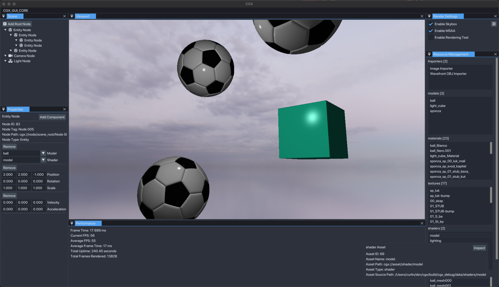

# cgx : curlin graphics engine
## 3D OpenGL Rendering Engine

 
#### This project is intended to be a multi-dimensional personal learning tool prompted by my perceived lack of experience/understanding of how to design a high-complexity software system -- experience which the fundamentals-oriented curriculum of a CS degree may not provide. 
#### My focus in developing this engine extends far beyond basic graphics programming -- this genre was selected in the hopes of building experience & deep understanding in the following areas:
* Modern C++, Build Systems, Debugging, and Cross-Platform Development
* Memory Management, Cache Behavior, & Data-Oriented Design
* OOP (Inheritance, Polymorphism, Composition, General Class Design)
* Graphics Programming, GPU Architecture, Linear Algebra, and Advanced Geometry
* ...

#### Features _(under constant revision)_

* OpenGL core renderer supporting full 3D, textures & materials, basic phong lighting, and more
* GLFW-based window and input handling 
* Basic event system providing easy observer / listener registration and hashed string-defined events & parameters
* Data-oriented Entity-Component-System (ECS) architecture providing extensibility and cache optimization  
* Intuitive scene and resource systems built on inheritance-based 'item' hierarchy to permit easy GUI integration
* ...

## Building
_This project is currently developed on macOS. Windows is supported but testing / MSVC compatibility is sporadic._

#### Prerequisites
- Set up a C++ compiler and debugger. The VSCode site has [full instructions for all platforms](https://code.visualstudio.com/docs/languages/cpp).
- Install [CMake](cmake.org) via your OS package manager of choice.
  - homebrew:  **brew install cmake**
  - ubuntu/debian : **sudo apt upgrade** & **sudo apt install cmake** 

### Visual Studio Code
- Install the [C++](https://marketplace.visualstudio.com/items?itemName=ms-vscode.cpptools) and [CMake Tools](https://marketplace.visualstudio.com/items?itemName=ms-vscode.cmake-tools) extensions for VS Code. 
- Open project root and run the **CMake: Configure** command via the command palette.
- After configuring, run the **CMake: Build**.

### CLion
- CMake is CLion's preferred build system for C++ and is fully supported. See their [Quick CMake Tutorial](https://www.jetbrains.com/help/clion/quick-cmake-tutorial.html).  
- _(in progress)_

### From Source (CMake)
- Navigate to the project root
- Create a binary directory:  **mkdir build**
- Configure the source and binary directories for CMake: **cmake -S . -B build**
- Build the project: **cmake --build build**
- To run the resulting testbed 'sandbox' application packaged with the engine (a static library): **./build/examples/sandbox/sandbox** 
 
### Visual Studio
- ~~uninstall visual studio and use literally anything else~~ _(in progress)_

##  Configuration
_(in progress)_

## Usage
_(in progress)_

## References & Acknowledgements
#### Materials
[learn OpenGL](https://learnopengl.com) _by Joey de Vries_ 
[Game Programming Patterns](https://www.google.com/url?sa=t&source=web&rct=j&opi=89978449&url=https://gameprogrammingpatterns.com/&ved=2ahUKEwjc5YCqlsiFAxWO4MkDHWU8AAMQFnoECBAQAQ&usg=AOvVaw0uvj7LgRpJvpRmdORsF0TK) _by Robert Nystrom_ 
[Game Engine Architecture](https://www.gameenginebook.com) _by Jason Gregory_ 
[Kohi Game Engine - Vulkan Game Engine series written in C](https://www.youtube.com/playlist?list=PLv8Ddw9K0JPg1BEO-RS-0MYs423cvLVtj) _by Travis Vroman_ 
[The Game Engine Programming Series](https://www.youtube.com/@GameEngineSeries/playlists) _by Arash Khatami_ 
[Bitsquid (a.k.a Autodesk Stinray)](http://bitsquid.blogspot.com) and [Our Machinery](https://ruby0x1.github.io/machinery_blog_archive/) development blogs _by Niklas Frykholm_ 
[Designing a Modern Rendering Engine](https://www.cg.tuwien.ac.at/research/publications/2007/bauchinger-2007-mre/bauchinger-2007-mre-Thesis.pdf) _by Matthias Bauchinger_ 
[songho personal blog](http://www.songho.ca/index.html) _by Song Ho Ahn_

#### Repositories

[erhe - a C++ library for modern OpenGL experiments](https://github.com/tksuoran/erhe) _by Timo Suoranta_ 
[delta studio engine](https://github.com/ange-yaghi/delta-studio) and [engine-sim](https://github.com/ange-yaghi/engine-sim) _by Ange Yaghi_ 
[godot engine](https://github.com/godotengine/godot) _by Juan Linietsky and Ariel Manzur_ 
[unreal engine](https://github.com/EpicGames) _(Epic Games)_ 

