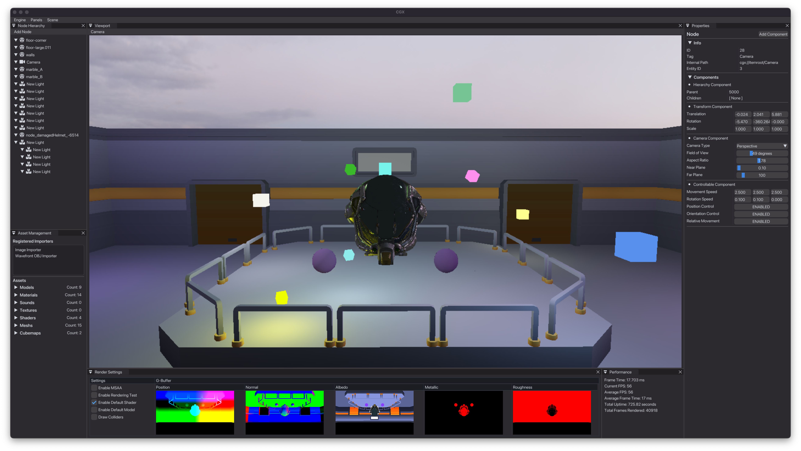

<h1 align = "center"> cgx </h1>

 
<i align = "center"> curlin graphics engine  </i> 

  

 
## Introduction 

`cgx` is a rendering engine built with C++ and OpenGL. The project was conceived as a personal learning tool spanning a breadth of concepts, skills, and technologies, including but not limited to:

* Modern C++, Build Systems, Debugging, and Cross-Platform Development
* Memory Management, Cache Behavior, & Data-Oriented Design
* OOP (Inheritance, Polymorphism, Composition, General Class Design)
* Graphics Programming, GPU Architecture, Linear Algebra, and Advanced Geometry
* ...

 Features 
 

* OpenGL core renderer supporting full 3D, textures & materials, deferred shading w/ phong & PBR lighting, cont.
* GLFW-based window and input handling 
* Basic event system providing easy observer / listener registration and hashed string-defined events & parameters
* Data-oriented Entity-Component-System (ECS) architecture providing extensibility and cache optimization  
* Intuitive scene and resource systems built on inheritance-based 'item' hierarchy to permit easy GUI integration
* ...

## Building

 Prerequisites 

- A C++ toolchain (clang, gcc, msvc). 
- CMake, which is available via installer on the [official site](https://cmake.org), or via your OS package manager of choice:
  - macOS: `brew install cmake` 
  - ubuntu/debian: `sudo apt install cmake` 
  - fedora: `sudo dnf install cmake` 
  - arch: `sudo pacman -S cmake` 
> Note: This project is currently developed on macOS. Windows is supported but MSVC compatibility is intermittent.

 From Source (CMake) 

- Navigate to the project root.
- Create a binary directory: `mkdir build`
- Configure the source and binary directories for CMake: `cmake -S . -B build`
- Build the project: `cmake --build build`
- To run the resulting testbed 'sandbox' application packaged with the engine (a static library): `./build/examples/sandbox/sandbox`

 CLion 

- CMake is CLion's preferred build system for C++ and is fully supported. See their [Quick CMake Tutorial](https://www.jetbrains.com/help/clion/quick-cmake-tutorial.html). 
- _(in progress)_

 Visual Studio Code 

- Install the [C++](https://marketplace.visualstudio.com/items?itemName=ms-vscode.cpptools) and [CMake Tools](https://marketplace.visualstudio.com/items?itemName=ms-vscode.cmake-tools) extensions for VS Code. 
- Open project root and run the `CMake: Configure` command via the command palette `(⇧⌘P)`.
- After configuring, run the `CMake: Build` command.

 Visual Studio 

- ~~uninstall visual studio and use literally anything else~~ _(in progress)_

 

##  Configuration
_(in progress)_

## Usage
_(in progress)_

## References & Acknowledgements
#### Materials
- **[learn OpenGL](https://learnopengl.com)** _by Joey de Vries_ 
- **[Game Programming Patterns](https://www.google.com/url?sa=t&source=web&rct=j&opi=89978449&url=https://gameprogrammingpatterns.com/&ved=2ahUKEwjc5YCqlsiFAxWO4MkDHWU8AAMQFnoECBAQAQ&usg=AOvVaw0uvj7LgRpJvpRmdORsF0TK)** _by Robert Nystrom_ 
- **[Game Engine Architecture](https://www.gameenginebook.com)** _by Jason Gregory_ 
- **[Kohi Game Engine - Vulkan Game Engine series written in C](https://www.youtube.com/playlist?list=PLv8Ddw9K0JPg1BEO-RS-0MYs423cvLVtj)** _by Travis Vroman_ 
- **[The Game Engine Programming Series](https://www.youtube.com/@GameEngineSeries/playlists)** _by Arash Khatami_ 
- The **[Bitsquid ](http://bitsquid.blogspot.com)** and **[Our Machinery](https://ruby0x1.github.io/machinery_blog_archive/)** development blogs _by Niklas Frykholm_ 
- **[Designing a Modern Rendering Engine](https://www.cg.tuwien.ac.at/research/publications/2007/bauchinger-2007-mre/bauchinger-2007-mre-Thesis.pdf)** _by Matthias Bauchinger_ 
- **[songho personal blog](http://www.songho.ca/index.html)** _by Song Ho Ahn_

#### Repositories

- **[erhe - a C++ library for modern OpenGL experiments](https://github.com/tksuoran/erhe)** _by Timo Suoranta_ 
- **[delta studio engine](https://github.com/ange-yaghi/delta-studio)** and **[engine-sim](https://github.com/ange-yaghi/engine-sim)** _by Ange Yaghi_ 
- **[godot engine](https://github.com/godotengine/godot)** _by Juan Linietsky and Ariel Manzur_ 
- **[unreal engine](https://github.com/EpicGames)** _(Epic Games)_ 

#### Assets

- **[Kenney](www.kenney.nl)**

## License

This project is licensed under the [MIT](./LICENSE.md) license.

